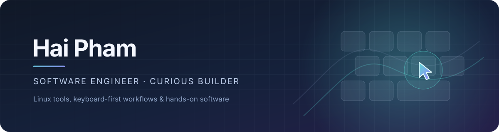

  
  
<strong>Software engineer · Linux tinkerer · curious builder</strong>

  

    
    
  

## Hey, I'm Hai 👋

I like building software that makes computers more useful, more personal, and a
little more fun. I'm especially drawn to Linux, keyboard-first workflows, and
understanding how things work all the way down—not just getting them to run.

### Things I build

- ⌨️ **Keyboard-first tools** — [Fievel](https://github.com/MontyTheSoftwareEngineer/fievel)
  turns a keyboard into a practical pointer for Linux and Wayland.
- 🐧 **Linux desktop projects** — custom Arch/Wayland workflows and tools that
  make a desktop feel like your own.
- 🧪 **Visual experiments** — interactive tools, little simulations, and
  projects that make complicated things easier to explore.
- 🎥 **Programming tutorials** — I share Qt, C++, and QML tips and hands-on
  examples with around 4K subscribers on
  [YouTube](https://www.youtube.com/@MontyTheSoftwareEngineer).

### Featured project

Fievel is a Rust app for controlling the pointer with the keyboard on Wayland.
It grew from a personal workflow into a configurable tool with remapping and
visual click hints.

### My toolbox

  
  
  
  
  

### Find me around the web

- 🎬 [YouTube](https://www.youtube.com/@MontyTheSoftwareEngineer) — Qt, C++,
  and QML tutorials and project examples
- 💼 [LinkedIn](https://www.linkedin.com/in/montythesoftwareengineer/)
- 💻 [All my repositories](https://github.com/MontyTheSoftwareEngineer?tab=repositories)

  Build it, understand it, make it a little better.

